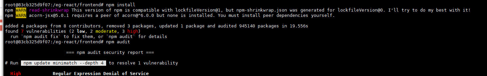

# EastCoastPlan

With the plethora of recreational facilities available, Singaporeans may find it troublesome to remember which platforms to use when making bookings for their facilities of choice. With that, EastCoastPlan is a Public Facility Booking Application that acts as a centralized platform for Singaporeans to view public facilities, make bookings and pay efficiently. The inuitive UI and seamless processes will ensure users get the best and most convenient experience while making bookings for their favourite facilities.

# Functions Available

## Universal

- Registration and Login
- Make a booking
- Payment

## User

- Report facility for damage

## Admin

- Manage availability of facilities

# Instructions
* Import database into localhost 
  * payment.sql
  * facility.sql
  * booking.sql
  * users.sql
  * report.sql

* Import kong configuration using KONGA
  1. After kong and KONGA is running, go to http://localhost:1337
  2. Create an account and log in
  3. Create a connection with
     - Name: default
     - Kong Admin URL: http://kong:8001
  4. Go to snapshot and select <b>IMPORT FROM FILE</b>
  5. Select the file provided <b>"kongconfig.json"</b>
  6. Open the snapshot and restore
     - Restore services and plugins first
     - Then restore the routes

# Frontend Installation
 1. Open up command prompt and change the directory to the frontend folder ("/frontend)
 2. Enter "npm install" into the command prompt and give it about 2 minutes to install all the dependencies
## Possible Errors

##### TL;DR: The error that you may encounter when downloading the dependencies is this: 
"<i>read-shrinkwrap This version of npm is compatible with lockfileVersion@1, but package-lock.json was generated for lockfileVersion@0. I'll try to do my best with it!</i>"
* In the event of an error similar to the picture above
  * Delete your package-json.lock file and type "npm install" again on the commmand prompt

# How to Run it
* Command prompt to our folder root directory and enter "docker-compose up -d --build"
  * <i>The command means that it will build all the necessary containers and images, and launch it once done building. You can also exit the command prompt at anytime after building completed.</i>
